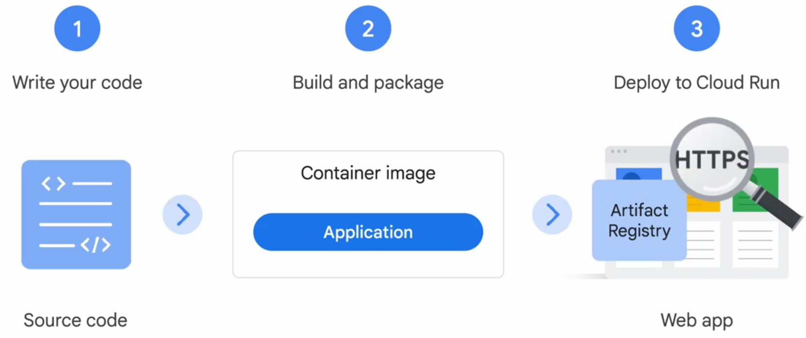

# Deploying a Streamlit App to Google Cloud Run using a container-based workflow with Docker and Artifact Registry

> *"Go from local development in VSCode to a live URL in minutes — using nothing but your terminal and a few gcloud commands."*

---



According to Google Cloud official documentation, [Cloud Run](https://cloud.google.com/run?hl=en) is a managed compute platform that enables you to run stateless containers that are invocable via HTTP requests. Cloud Run is serverless: it abstracts away all infrastructure management, so you can focus on what matters most — building great applications.

The developer workflow in Cloud Run is very simple:

1. You write your application using your favorite programming language. This application should start a server that listens for web requests.

2. The application is built and packaged into a container image. 

3. The container image is pushed to the artifact registry, where Cloud Run will deploy it. 


With Cloud Run, you can use two types of workflow: container-based workflow or a source-based workflow. 

Container-based workflow means you take charge of the building and packaging your application yourself. Sometimes you're just looking for a way to turn your source code into an HTTPS endpoint. And you want your vendor to make sure your container image is secure, well configured and built in a consistent way. The source-based approach will deploy source code instead of a container image. Under the hood, Cloud Run then builds the source and packages the application into a container image. Cloud Run does this using Buildpacks. Buildpacks is an open source tool that automatically detect your application type and build a container image without needing a Dockerfile.

Either way, Cloud Run ultimately runs a container image. The only difference is whether you choose to build that image yourself or let Cloud Run handle it for you from your source code. In this article, we’ll explore the container-based approach by manually building the image using Docker.


## Overview

In this tutorial, you'll learn how to:

* Build a **Streamlit app** and test it locally 
* Contenarize the app using **Docker** and run the container in local
* Push the image to **Google Artifact Registry**
* Deploy the containerized app to **Cloud Run**
* Do everything from your **local VSCode terminal**, without using the Cloud Console

Whether you're a data scientist or developer or just interested in deploying applications in the Cloud, this guide will walk you through a powerful production-grade deployment workflow.

---

## Prerequisites

* Python 3.x
* VSCode
* [gcloud CLI](https://cloud.google.com/sdk/docs/install)
* Docker
* A GCP Project with billing enabled

---

## Step 0 — Prepare Your Local Environment and Streamlit App

Start by creating a GitHub repository for your project and clone it to your local machine:

```bash
git clone https://github.com/YourGitHubProfile/YourRepoName.git
cd YourRepoName
python3 -m venv .venv
source .venv/bin/activate
code .
mkdir ContainerBasedWorkflow && cd ContainerBasedWorkflow
touch app.py
pip install streamlit
pip show streamlit > requirements.txt
```

Update your `requirements.txt` to specify the Streamlit version:

```
streamlit==1.45.1
```

Then write a simple app in `app.py`:

```python
import streamlit as st

st.title("Google Cloud Run Container-Based Workflow Example")
```

To test the app locally:

```bash
streamlit run app.py
```

Open your browser at `http://localhost:8501` to verify that it works.

Now you're ready to containerize and deploy!

---

## Step 1: Authenticate and Create a Configuration

* Using the Google Cloud Console, create a new project (example: "hello cloud run")

```bash
gcloud init
```

Choose to **create a new configuration**, give it a name (e.g. `cloud-run-demo`), and follow the prompts to:

* Select your GCP project 
* Authenticate your Google account

Select an account to use (You have to choose or sign with the Google Account where your GCP Project is created):

Or

Config your Google Cloud Account by using this command:

```bash
gcloud config set account your-email@gmail.com
```

Pick cloud project to use:

Or 

Set the active project by using this command:

```bash
gcloud config set project YOUR_PROJECT_ID
```

* For verification, you can list the active account name with this command:

```bash
gcloud auth list
```

* Still for verification, you can list the project ID with this command:

```bash
gcloud config list project
```

---

## Step 2: Enable Cloud Run 

```bash
gcloud services enable run.googleapis.com
```

Running this command will return an error if your GCP Project is not associated with a billing account. If so, you must **link a billing account** to your project. Here’s how:

### Option 1: Via Web (Easiest)

1. Go to the [GCP Billing Page](https://console.cloud.google.com/billing).
2. If you don’t have a billing account, **create one** (you can start with the free trial).
3. Then link it to your project:

   * Go to [Billing → My Projects](https://console.cloud.google.com/billing/projects)
   * Click "Change billing account" for `your_project_id`
   * Select your billing account and save

> You need billing enabled to use **Cloud Run**. Don't worry, this tutorial will cost you €0. We will delete the project at the end of the tutorial.

---

### Option 2: CLI (If Billing Account Already Exists)

To get list billing accounts:

```bash
gcloud beta billing accounts list
```

If you already have a billing account ID (e.g., `012345-6789AB-CDEF01`), run:

```bash
gcloud beta billing projects link hello-cloud-run-463119 \
  --billing-account=012345-6789AB-CDEF01
```


To get a list of billing accounts:

```bash
gcloud beta billing accounts list
```

---

## Note

You won’t be charged if:

* You stay within [Cloud Run Free Tier](https://cloud.google.com/run/pricing)
* You're still on the free trial (\$300 credit)

---

Once billing is linked, you can retry:

```bash
gcloud services enable run.googleapis.com
```

---

## Step 3: Define Environment Variables

In your terminal:

```bash
export REGION=europe-west9
export PROJECT_ID=$(gcloud config get-value project)
```

Choose a region close to your users. For France, `europe-west9` (Paris) is ideal. In order to know all available locations for Artifact Registry, execute this command and choose an appropriate region:

```bash
gcloud artifacts locations list
```

---

## Step 4: Create a Docker Repository in Artifact Registry

This command creates a directory named "app-repo":

```bash
gcloud artifacts repositories create app-repo --repository-format=docker --location=$REGION
```

To display the details of your new repository:

```bash
gcloud artifacts repositories describe app-repo --location=$REGION
```

Configure Docker to use Artifact Registry:

```bash
gcloud auth configure-docker ${REGION}-docker.pkg.dev
```

---

## Step 5: Create a Dockerfile

```dockerfile
FROM python:3.12-slim

EXPOSE 8080

WORKDIR /app

COPY . ./

RUN pip install -r requirements.txt

ENTRYPOINT ["streamlit", "run", "app.py", "--server.port=8080", "--server.address=0.0.0.0"]
```

---

## Step 6: Build and Push the Docker Image

Build the image locally:

```bash
docker build -t ${REGION}-docker.pkg.dev/${PROJECT_ID}/app-repo/hello-streamlit:latest .
```

To list all images in your local environment and make sure your image is there:

```bash
docker images
```

You can also run and test the container in local in order to make sure everything is working:

```bash
docker run -p 8080:8080 ${REGION}-docker.pkg.dev/${PROJECT_ID}/app-repo/hello-streamlit:latest
```

Push the image to Artifact Registry:

```bash
docker push $REGION-docker.pkg.dev/$PROJECT_ID/app-repo/hello-streamlit:latest
```

In Google Console, go to Artifact Registry and clic on app-repo (the name of your repository) to verify that your new image is there.

---

## Step 7: Deploy to Cloud Run

```bash
gcloud run deploy hello-streamlit \
  --image=$REGION-docker.pkg.dev/$PROJECT_ID/app-repo/hello-streamlit:latest \
  --region=$REGION \
  --allow-unauthenticated
```

The allow-unauthenticated flag in the command above makes your service publicly accessible. 

In Google Console, go to Cloud Run and make sure your new service hello-stramlit is there. The command will generate the service URL of your app. You can test it on any web browser like Chrome.

```
https://hello-streamlit-xxxxxxxxxx-ew9.a.run.app
```

Click it to see your app live!

---

## Conclusion

You've just deployed a Streamlit app to Google Cloud Run using:

* Docker
* Artifact Registry
* gcloud CLI

And all from your terminal in VSCode.

The GitHub repo of this article: https://github.com/JosueAfouda/hello-cloud-run

You can also watch this video: 

---

Join me on Linkedin [here](https://www.linkedin.com/in/josu%C3%A9-afouda).
